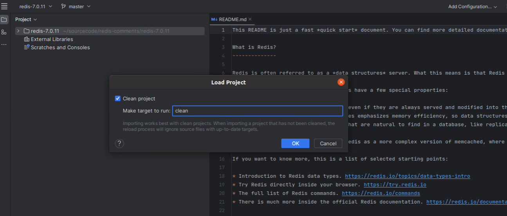
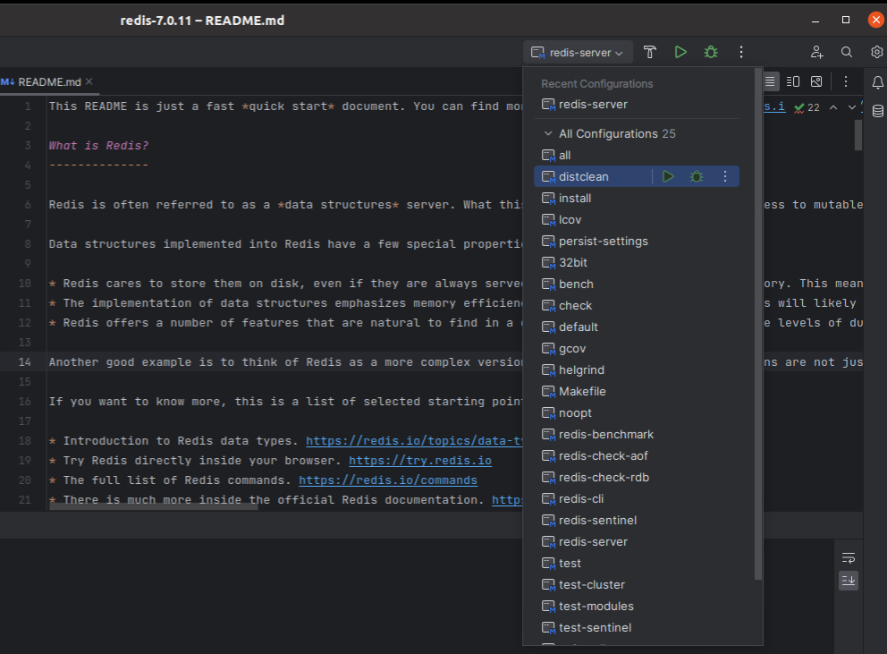
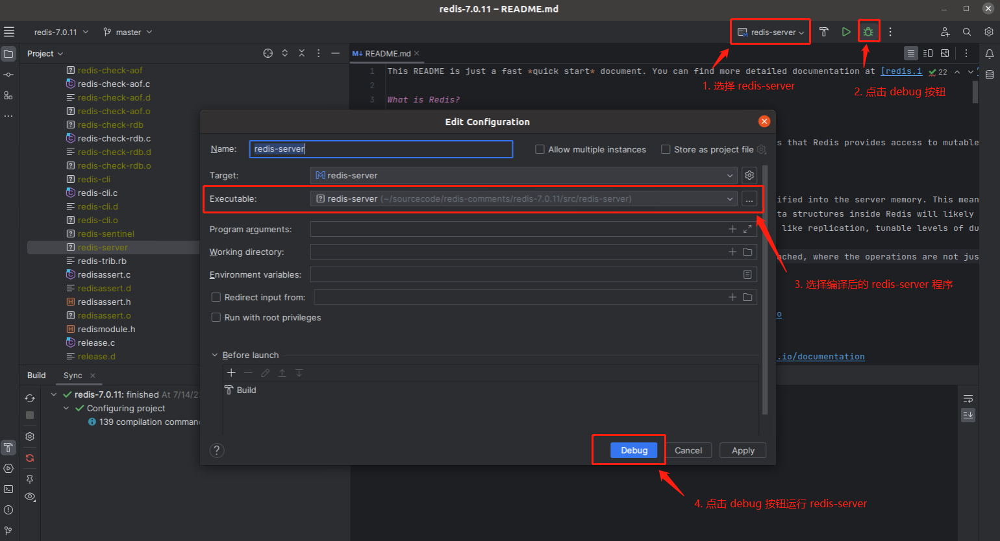

# Redis-7.0.11 中文注释版本

此注释版基于 [Redis 7.0.11](https://github.com/redis/redis/tree/7.0.11) 编写了主要流程的中文注释，便于在学习 Redis 的过程中了解底层的设计原理与实现机制。

在掌握了 Redis 基本的原理与应用之后，我们便可将其源码构建起来，通过 Debug 的方式来逐行分析底层的一些设计实现，正本溯源，而不仅仅是浮于表面，只知其一不知其二。

## Redis架构概览
> TODO

## Redis源码概览

> TODO

| 列1标题  | 列2标题 | 列3标题 |
|---------|---------|---------|
| 单元格1 | 单元格2 | 单元格3 |
| 单元格4 | 单元格5 | 单元格6 |

## Redis源码阅读环境构建
此处我们采用操作系统 [Ubuntu 20.04.4 LTS](https://releases.ubuntu.com/focal/) 来构建 Redis 源码阅读环境，使用其他类 Unix 系统比如 MacOS 也可以按照此操作来进行构建。Windows 系统则建议安装一个 VirtualBox 或者 vmware 虚拟机来构建。

或者通过其他云厂商的云主机来进行构建，如阿里云的[无影云电脑](https://www.aliyun.com/minisite/goods?userCode=u47plryb)，4核8G的云电脑新用户可免费使用3个月。


### 源码clone与编译
进入操作系统，打开 Terminal 终端。

首先确保系统支持C语言的编译，C语言的编译需要有 gcc 的工具支持，gcc 是一种功能强大的C语言编译器，是开发和构建 C 语言项目的重要工具：
```bash
# 查看 gcc 的版本号，如果存在则输出对应信息：gcc version 9.4.0 (Ubuntu 9.4.0-1ubuntu1~20.04.1)
gcc -v

# 如无 gcc 环境，则需安装
sudo apt install gcc
```

创建对应的文件夹来存储 Redis 源代码：
```bash
# 创建 sourcecode 文件夹并进入到文件夹内
mkdir ~/sourcecode && cd ~/sourcecode
```

克隆代码到本地：
```bash
git clone https://github.com/whoiszxl/redis-comments.git
```

进行代码的构建：
```bash
# 进入到 Redis 源码路径下
cd ~/sourcecode/redis-comments/redis-7.0.11/

# 执行 make 命令进行构建，执行后会打包出一批 redis-server、redis-cli 的可执行程序出来
make CFLAGS="-g -O0"
```
make 命令之后，携带了一部分参数，CFLAGS 是一个环境变量，用于指定编译器的编译选项。其中 -g 则表示在编译过程中生成调试信息，-O0 则表示需要关闭优化选项，编译器通常会对代码进行优化，以提高执行速度或减少生成的可执行文件的大小，这样就会导致我们编译出来的 Redis 可执行文件中的代码和 Redis 源码会产生不一致的情况，极大可能会出现代码结构不一致，执行流程不一致的情况。所以，我们需要通过 -O0 参数来关闭优化选项，避免 Debug 时出现一些迷之问题。

倘若是发布 Redis 到生产环境使用，则无需添加这些参数，直接执行 `make` 即可。


在命令行中运行编译好的 Redis 服务:
```bash
# 要使用默认配置运行 Redis，只需键入：
cd ~/sourcecode/redis-comments/redis-7.0.11/src
./redis-server

# 使用 redis.conf 配置来运行，则须使用一个额外的参数（配置文件的路径）来运行：
./redis-server ../redis.conf

# 也可以通过命令行直接传递参数作为选项来改变Redis配置：
./redis-server --port 9999 --replicaof 127.0.0.1 6379
./redis-server ../redis.conf --loglevel debug
```

使用 redis-cli 客户端来连接上一步启动的 redis-server：
```bash
# 开启一个新的 Terminal 终端，并进入到 src 目录下
cd ~/sourcecode/redis-comments/redis-7.0.11/src

# 执行 redis-cli 命令进入客户端交互模式
./redis-cli

# 执行 ping 命令测试一下连接是否有效
redis> ping
PONG

# 测试 set get 命令
redis> set name whoiszxl
OK
redis> get name
"whoiszxl"

# 测试 incr 命令
redis> incr mycounter
(integer) 1
redis> incr mycounter
(integer) 2
```

可以在这个链接中找到所有可用的 Redis 命令：[https://redis.io/commands](https://redis.io/commands)


### 在IDE中运行源码
上述步骤已将源码编译，可以正常运行之后便可将此源码运行到 IDE 中。这里我们使用 JetBrains 的 [Clion](https://www.jetbrains.com/clion/) 来运行源码。

点击此链接[https://www.jetbrains.com/clion/download/#section=linux](https://www.jetbrains.com/clion/download/#section=linux)进行下载，或者系统为 Ubuntu 16.04 或以上的话，可以执行此命令 `sudo snap install clion --classic` 来进行安装。

通过下载的方式，解压之后的目录如下：
```
clion-2023.1.4
├── bin
├── build.txt
├── help
├── Install-Linux-tar.txt
├── jbr
├── lib
├── license
├── plugins
└── product-info.json
```

执行命令进行启动：`sh ./bin/clion.sh`


初次打开时，Clion 会提示你加载项目前需要先 `Clean Project`, 此处需要点 OK 来先清理项目，此操作会将之前执行 `make CFLAGS="-g -O0"` 命令编译出来的可执行文件清理掉，执行成功后，下方的 Build 会提示构建完成。


提示完成之后，还需重新进入 `~/sourcecode/redis-comments/redis-7.0.11/` 目录下，重新执行 `make CFLAGS="-g -O0"` 命令构建一次。（或者在未编译时通过 Clion 打开源码，便仅需编译一次）

编译完成之后，Clion 右上方的运行配置中，便会有一系列的可执行配置，如下图所示。




接着选择到 redis-server 这一项，直接点击 debug 运行按钮，则会弹出一个配置框，此处需要在 Executable 中选择我们编译好的 redis-server 程序，最后，点击最下方的 debug 按钮来运行 redis-server 程序。




