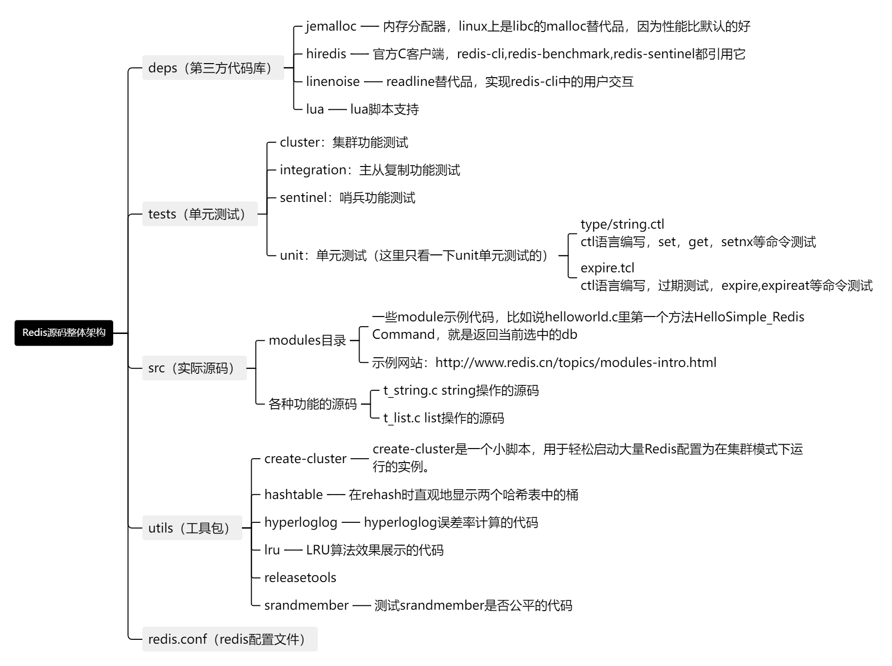

# Redis-7.0.11 中文注释版本

此注释版基于 [Redis 7.0.11](https://github.com/redis/redis/tree/7.0.11) 编写了主要流程的中文注释，便于在学习 Redis 的过程中了解底层的设计原理与实现机制。

在掌握了 Redis 基本的原理与应用之后，我们便可将其源码构建起来，通过 Debug 的方式来逐行分析底层的一些设计实现，正本溯源，而不仅仅是浮于表面，只知其一不知其二。

## Redis源码整体架构


## Redis源码阅读环境构建
此处我们采用操作系统 [Ubuntu 20.04.4 LTS](https://releases.ubuntu.com/focal/) 来构建 Redis 源码阅读环境，使用其他类 Unix 系统比如 MacOS 也可以按照此操作来进行构建。Windows 系统则建议安装一个 VirtualBox 或者 vmware 虚拟机来构建。

或者通过其他云厂商的云主机来进行构建，如阿里云的[无影云电脑](https://www.aliyun.com/minisite/goods?userCode=u47plryb)，4核8G的云电脑新用户可免费使用3个月。


### 源码clone与编译
进入操作系统，打开 Terminal 终端。

首先确保系统支持C语言的编译，C语言的编译需要有 gcc 的工具支持，gcc 是一种功能强大的C语言编译器，是开发和构建 C 语言项目的重要工具：
```bash
# 查看 gcc 的版本号，如果存在则输出对应信息：gcc version 9.4.0 (Ubuntu 9.4.0-1ubuntu1~20.04.1)
gcc -v

# 如无 gcc 环境，则需安装
sudo apt install gcc
```

创建对应的文件夹来存储 Redis 源代码：
```bash
# 创建 sourcecode 文件夹并进入到文件夹内
mkdir ~/sourcecode && cd ~/sourcecode
```

克隆代码到本地：
```bash
git clone https://github.com/whoiszxl/redis-comments.git
```

进行代码的构建：
```bash
# 进入到 Redis 源码路径下
cd ~/sourcecode/redis-comments/redis-7.0.11/

# 执行 make 命令进行构建，执行后会打包出一批 redis-server、redis-cli 的可执行程序出来
make CFLAGS="-g -O0"
```
make 命令之后，携带了一部分参数，CFLAGS 是一个环境变量，用于指定编译器的编译选项。其中 -g 则表示在编译过程中生成调试信息，-O0 则表示需要关闭优化选项，编译器通常会对代码进行优化，以提高执行速度或减少生成的可执行文件的大小，这样就会导致我们编译出来的 Redis 可执行文件中的代码和 Redis 源码会产生不一致的情况，极大可能会出现代码结构不一致，执行流程不一致的情况。所以，我们需要通过 -O0 参数来关闭优化选项，避免 Debug 时出现一些迷之问题。

倘若是发布 Redis 到生产环境使用，则无需添加这些参数，直接执行 `make` 即可。

**注意事项：**
如果执行 `make CFLAGS="-g -O0"` 后，运行 `./src/redis-server` 后报错：`Segmentation fault (core dumped)`，可以执行 `make distclean` 清理目前的编译结果，再执行 `make CFLAGS="-g -O0" MALLOC=libc` 进行编译即可解决此问题，`MALLOC=libc` 参数为强制指定 `libc` 为 `malloc` 做内存分配。


在命令行中运行编译好的 Redis 服务:
```bash
# 要使用默认配置运行 Redis，只需键入：
cd ~/sourcecode/redis-comments/redis-7.0.11/src
./redis-server

# 使用 redis.conf 配置来运行，则须使用一个额外的参数（配置文件的路径）来运行：
./redis-server ../redis.conf

# 也可以通过命令行直接传递参数作为选项来改变Redis配置：
./redis-server --port 9999 --replicaof 127.0.0.1 6379
./redis-server ../redis.conf --loglevel debug
```

使用 redis-cli 客户端来连接上一步启动的 redis-server：
```bash
# 开启一个新的 Terminal 终端，并进入到 src 目录下
cd ~/sourcecode/redis-comments/redis-7.0.11/src

# 执行 redis-cli 命令进入客户端交互模式
./redis-cli

# 执行 ping 命令测试一下连接是否有效
redis> ping
PONG

# 测试 set get 命令
redis> set name whoiszxl
OK
redis> get name
"whoiszxl"

# 测试 incr 命令
redis> incr mycounter
(integer) 1
redis> incr mycounter
(integer) 2
```

可以在这个链接中找到所有可用的 Redis 命令：[https://redis.io/commands](https://redis.io/commands)


### 在IDE中运行源码
上述步骤已将源码编译，可以正常运行之后便可将此源码运行到 IDE 中。这里我们使用 JetBrains 的 [Clion](https://www.jetbrains.com/clion/) 来运行源码。

点击此链接[https://www.jetbrains.com/clion/download/#section=linux](https://www.jetbrains.com/clion/download/#section=linux)进行下载，或者系统为 Ubuntu 16.04 或以上的话，可以执行此命令 `sudo snap install clion --classic` 来进行安装。

通过下载的方式，解压之后的目录如下：
```
clion-2023.1.4
├── bin
├── build.txt
├── help
├── Install-Linux-tar.txt
├── jbr
├── lib
├── license
├── plugins
└── product-info.json
```

执行命令进行启动：`sh ./bin/clion.sh`


初次打开时，Clion 会提示你加载项目前需要先 `Clean Project`, 此处需要点 OK 来先清理项目，此操作会将之前执行 `make CFLAGS="-g -O0"` 命令编译出来的可执行文件清理掉，执行成功后，下方的 Build 会提示构建完成。


提示完成之后，还需重新进入 `~/sourcecode/redis-comments/redis-7.0.11/` 目录下，重新执行 `make CFLAGS="-g -O0"` 命令构建一次。（或者在未编译时通过 Clion 打开源码，便仅需编译一次）

编译完成之后，Clion 右上方的运行配置中，便会有一系列的可执行配置，如下图所示。


接着选择到 redis-server 这一项，直接点击 debug 运行按钮，则会弹出一个配置框，此处需要在 Executable 中选择我们编译好的 redis-server 程序，最后，点击最下方的 debug 按钮来运行 redis-server 程序。此方式运行则会采用默认的配置，如需要采用自定义配置，则可在 Program arguments 中填入 redis.conf 的绝对路径。


### 断点调试
当环境构建好后，便可打上断点调试代码。此处以执行一个 set 命令来做断点调试。

首先，找到 `t_string.c` 这个代码文件，这个文件专门用来处理 `String` 相关的命令。我们需要在一个 `setCommand` 函数里打上一个断点。


然后，我们可以将 `redis-cli` 启动，用以执行 set 命令。我们可以选择执行运行 `redis-cli` 程序，也可以在 `Clion` 中选择上一步 Debug 调试 redis-server 的逻辑一样，通过 Debug 的方式将 `redis-cli` 运行起来。

运行起来之后，便可执行一个 set 命令，如：`set username whoiszxl`，则我们可以看到 `Clion` 中的断点已经打进去了。断点打上去之后，将鼠标指针指向对应实例之后，便可以看到实例的相关信息。

如图所示，将鼠标指针指向 `client` 指针后，我们便可以看到 `client` 实例的相关信息，如 `querybuf` 中可以看到客户端发送过来的 `RESP` 协议的消息体，`cmd` 中可以看到 `set` 命令的相关描述，如 `complexity` 字段中可看到其命令的时间复杂度。


## 如何阅读源码
以 Redis 为例，此处则以一个 Web 开发者的角度来阐述阅读一个中间件的源码的通用思路。

### 确定目标
首先第一步是先需要确定目标，需要明确自己想要学习的技术是什么，比如说我们这里就是要学习 `Redis`。我们需要先了解这个技术的基本概念、用途以及特点等等。接着就是需要获取到对应的资源，包括官方文档、书籍、在线教程、视频课程等。这些资料可以帮助你系统地学习技术的各个方面。

从 `Redis` 来说，我们要分析清楚这个技术的基本概念、用途以及特点，只需要从[官网](https://redis.io/)就能得到结果。

官网简介如下：

> Redis是一个开源的内存数据存储系统，被数百万开发者用作数据库、缓存、流处理引擎和消息中间件。它提供了一种快速、高性能的数据存储和处理解决方案。


核心特性如下：
* 内存中的数据结构：Redis被广泛称为“数据结构服务器”，支持字符串、哈希、列表、集合、有序集合、流等多种数据结构。
* 可编程性：Redis支持使用Lua进行服务器端脚本编程，还支持使用Redis Functions进行服务器端存储过程编程。
* 可扩展性：Redis提供了C、C++和Rust的模块API，可以通过编写自定义扩展模块来扩展Redis的功能。
* 持久化：Redis将数据保存在内存中以实现快速访问，但同时可以将所有写操作持久化到永久存储介质上，以便在重启和系统故障时恢复数据。
* 分布式集群：Redis支持基于哈希的分片机制进行水平扩展，可以扩展到数百万个节点，并在集群扩展时自动进行重新分片。
* 高可用性：Redis支持主从复制和自动故障转移，无论是独立部署还是集群部署，都可以实现高可用性。

用途如下：
* Redis是一个实时数据存储系统，它的多功能内存数据结构使得构建实时应用程序的数据基础设施变得容易，这些应用程序需要低延迟和高吞吐量。
* 作为缓存和会话存储，Redis的速度非常快，非常适合用于缓存数据库查询、复杂计算、API调用和会话状态等。通过将热门数据存储在Redis的内存中，可以大大加快数据访问速度，减轻后端数据库的负载。
* Redis的流数据类型使得高速数据摄取、消息传递、事件溯源和通知等场景成为可能。它可以接收和存储高速数据流，并支持按时间顺序获取数据，可以应用于流式数据处理、实时分析和实时通信等应用。

### 深入学习
从官网分析清楚后，我们便可通过获取的 `Redis` 资源深入学习其原理、应用与源码。需要掌握的技能如下：
* 掌握各种数据类型的基本使用，包括字符串（string）、列表（list）、哈希（hash）、集合（set）、有序集合（zset）、位图（bitmap）、HyperLogLog、地理位置（geo）、流（stream）和bitfield。
* 熟悉持久化策略，包括RDB和AOF的使用。了解如何将数据持久化到磁盘，以便在重启或系统故障时恢复数据。
* 理解主从复制和哨兵监控的概念与使用。如何配置和管理Redis的主从复制，以及如何使用哨兵监控Redis实例的健康状态和自动故障转移。
* 学习Redis集群分片的原理和使用。了解如何在Redis集群中分片数据以实现水平扩展和高可用性。
* 第三方应用整合 Redis 应用，如 Java，Golang，Php 应用整合实现一些业务方案，业务方案如：分布式缓存、分布式锁、会话存储、计数器等。
* ......

总而言之在读源码前必须先掌握 Redis 的基础应用。

### 整体分析
在掌握了一个中间件的基础应用后，便可以开始分析中间件的源码了。首先需要获取到相关源代码。以 Redis 为例，我们可以从 [Redis官网](https://redis.io/) 获取，或者从 Github 上获取，Redis 的 Github 地址为：[https://github.com/redis/redis](https://github.com/redis/redis) 。从 Github 获取源代码，我们可以很方便的从分支管理中获取特定的版本，本仓库便是基于 [Redis 7.0.11](https://github.com/redis/redis/tree/7.0.11) 构建。

获取到对应的源码后，首先应该做的便是对源码做一个**整体分析**。读源码最忌讳的便是漫无目的的阅读，所以我们先需要分析一下 redis-7.0.11 这个目录下，有一些什么目录，有一些什么源码文件，得到一个大致的认识之后，我们再去读源码时才会有路可寻。

做整体分析，我们也得掌握一定的方法。首先，最好的方法便是阅读源码中自带的注释或者 README 文件。举例来说，Redis 源码的一级目录下有一个 deps 文件夹，打开之后便有一个 [README.md](https://github.com/whoiszxl/redis-comments/blob/master/redis-7.0.11/deps/README.md) 文件，此文件开头内容如下：
> This directory contains all Redis dependencies, except for the libc that should be provided by the operating system.
>
> Jemalloc is our memory allocator, used as replacement for libc malloc on Linux by default. It has good performances and excellent fragmentation behavior. This component is upgraded from time to time.
>
> hiredis is the official C client library for Redis. It is used by redis-cli, redis-benchmark and Redis Sentinel. It is part of the Redis official ecosystem but is developed externally from the Redis repository, so we just upgrade it as needed.
>
> linenoise is a readline replacement. It is developed by the same authors of Redis but is managed as a separated project and updated as needed.
>
> lua is Lua 5.1 with minor changes for security and additional libraries.
>
> hdr_histogram Used for per-command latency tracking histograms.

翻译如下：

> 该目录包含了 Redis 的所有依赖项，除了操作系统应提供的 libc（C 标准库）。
> 
> Jemalloc：作为内存分配器，它替代了 Linux 默认的 libc malloc。Jemalloc 具有良好的性能和优秀的内存碎片处理能力。我们定期升级此组件以获得更好的性能和功能。
>
> Hiredis：这是 Redis 的官方 C 客户端库。它被 redis-cli、redis-benchmark 和 Redis Sentinel 等工具所使用。尽管它是 Redis 生态系统的一部分，但是它是在 Redis 主代码库之外进行开发的。我们根据需要升级它以引入改进和修复 bug。
>
> Linenoise：Linenoise 是一个 readline 的替代品，提供了交互式命令行界面的行编辑功能。它由 Redis 的作者开发，但作为一个独立的项目进行管理，并根据需要进行更新。
>
> Lua：Redis 包含了 Lua 5.1 版本，并进行了一些安全修改和附加库的添加。Lua 是一种强大的脚本语言，用于在 Redis 中进行服务器端脚本编写，实现自定义命令和高级数据处理功能。
>
>hdr_histogram：该依赖项用于跟踪每个命令的延迟，并生成直方图。它帮助测量和分析 Redis 命令的执行时间，对于性能监控和优化非常有用。

通过此 `README.md` 文件，我们不难得出 `deps` 文件夹的作用是做什么的。再比如说 Redis Github 主页的 `README.md` 文件，其中详细描述了各大核心文件的用途。所以，我们要整体分析 Redis 架构的话，通过此种方式便能得出一二。

Redis 大致的源代码分析图可参照此 README 最上方的Redis源码整体架构。

### 寻找入口
清楚了 Redis 源码的整体架构之后，我们便可有选择性的来阅读代码了。要阅读代码的话，最好的办法便是通过 Debug 的方式来执行代码，再根据技术的原理进行相互验证。如若只是在编辑器中观看代码，行之定然不太有效。所以，再此之前，可以按照此 README 前部分来搭建好源码阅读的环境。

搭建好后，便是寻找源码阅读的入口。入口则有多种：
* 入口文件：通常开源中间件的源码会有一个主要的入口文件，Redis 中的入口文件便是 `src/server.c`，其中有一个 `main` 方法，执行后便可启动 `redis-server`，从此文件便可以了解整个服务的启动过程与基本的功能。在阅读其他中间件源码也是类似，像 Nacos、Kafka 等中间件的入口都是通过一个 main 方法启动。
* 核心模块：根据中间件的功能和设计，可以选择阅读其中的核心模块。对于 Redis 来说，核心模块包括各大数据类型、网络通信模块、命令解析与执行模块等。选择其中一个核心模块作为入口开始阅读，可以深入了解该模块的实现原理和关键算法。
* 命令执行：根据一条命令的执行，分析一条命令从 Client 端发送到 Server 端的执行过程。通过这种方式可以从命令解析、网络通信、命令执行、数据类型皆有涉及，当整条链路分析完成之后，其大部分的源码便已是通读了，因为在执行不同的命令时，命令解析、网络通信、命令执行等逻辑都是一致的，不同的仅仅是数据结构上的不同。

我们这里采用 `命令执行` 的方式来分析如何阅读源码。


### 命令执行
这里我们便通过一条命令执行了解 Redis 的命令执行流程。

在我们还没开始阅读源码的时候，我们可以通过猜测的方式来了解 Redis 执行一条命令的工作机制。作为一名 Web 开发者，当我们在开发完成一个 Web 程序的时候，以 Java 的 SpringBoot 程序为例，我们会通过 `maven` 这个构建工具来将 SpringBoot 程序打包成 Jar 包，然后我们便可通过 `java -jar xx.jar` 此命令来将 Web 程序运行起来。

此逻辑其实和 Redis 构建是类似的，`make` 命令则与 `maven` 类似，执行 `make` 命令后，其便会将 C 语言编写的一系列源码打包成可执行文件，如：`redis-server, redis-cli` 等。此时，我们通过直接运行 `redis-server` 程序，便可直接将 Redis 服务运行起来，此方式则和我们通过 `java` 命令将 SpringBoot 程序运行起来的逻辑是非常相似的。

当一个 SpringBoot 程序运行起来之后，我们便可通过浏览器、PostMan、CURL 等工具来访问 SpringBoot 程序暴露出来的 HTTP 接口，或者通过 VUE、React等前端框架来调用程序中的 HTTP 接口。

此逻辑也与 `redis-server` 的逻辑是类似的，当服务运行起来的时候，我们可通过 redis-cli、Another Redis Desktop Manager 等客户端工具来执行对应的命令，也可通过 Java、Golang、NodeJS 等编程语言来执行对应的命令。此方式和我们 SpringBoot 程序暴露 HTTP 接口的方式也是非常类似的，只不过 `redis-server` 是通过 TCP 的方式将一些 SET/GET/EXPIRED 命令暴露出来。当我们通过 Client 程序执行其命令的时候，Server 接收到命令，也会通过与 SpringBoot 类似的原理，将命令按照一定规则转发到对应的方法上。

如下 SpringBoot 接口，当我们通过 POST 请求访问 `http://localhost:80/login` 的时候，请求会通过一定逻辑转发到这个方法里面。
```java
    @SaIgnore
    @Operation(summary = "管理员后台登录", description = "根据管理员用户名和密码进行登录")
    @PostMapping("/login")
    public ResponseResult<String> login(@Validated @RequestBody LoginByPasswordCommand command) {
        //DO SOMETHING
        return ResponseResult.buildSuccess(token);
    }
```

Redis 也一样，当我们执行 `set username whoiszxl` 命令时，命令会通过一定逻辑转发到这个 `setCommand` 函数里面。

```c
void setCommand(client *c) {
    
    /** 省略部分代码....... */
    
    /** 
     * 调用setGenericCommand函数，将flags、c->argv[1]（即键）、c->argv[2]（即值）、expire、unit以及
     * 其他参数传递给该函数，从而在Redis中设置键值对。 
     * */
    setGenericCommand(c,flags,c->argv[1],c->argv[2],expire,unit,NULL,NULL);
}
```

所以，Redis 这种 C/S 架构的程序，与 SpringBoot 这种 B/S 架构的程序，整体逻辑上也是相差无几的。我们在 Debug 一个 Web 程序的时候，直接在 Controller 接口上打上断点便可，那我们要 Debug 一个 Redis 程序，那么也是可以在对应函数上打上断点就可。我们此处以一条 SET 命令来执行，那么在 `setCommand` 方法上打上断点即可。

断点打上之后，当客户端发送一条命令到服务端时，请求便会进入 `setCommand` 上的断点，接着我们便可从左下方 Debugger 栏目中看到这个 SET 命令执行的整条链路，如图所示。


通过 `Parallel Stacks` 中，我们可以得到如下的并行调用栈信息。通过双击每个函数的名称便能够跳转到对应代码位置。


更多使用 Clion 进行 Debug 的方式可以通过官网进行查看：[https://www.jetbrains.com/help/clion/debugging-code.html?keymap=primary_eclipse#useful-debugger-shortcuts](https://www.jetbrains.com/help/clion/debugging-code.html?keymap=primary_eclipse#useful-debugger-shortcuts)

### 流程分析
接下来我们便来分析一下这个调用栈的整个链路。

#### aeMain
首先定位到 `main` 函数中，可见此时跳转到的是 `server.c` 文件下的 `main()` 函数的 `aeMain` 函数中。此处代码的作用是要运行一个事件处理器，专门来处理各种事件。在 `深入学习` 阶段，我们是需要掌握 Redis 单线程运行里一个比较核心的概念，就是：`I/O 多路复用`。这一块的代码，我们需要理解透的话，那就必须将此概念掌握后才能够更好的看懂。

```c
int main(int argc, char **argv) {

    /** 省略部分代码 */

    /* 【核心】：运行ae事件处理器，直到服务关闭为止 */
    aeMain(server.el);
    
    /** 省略部分代码 */
}
```

这里用一个生活中的案例，将 `I/O 多路复用` 的思想简单阐述一下。

假设一个餐厅里只有你一名服务员，餐厅里有多个餐位，每个桌子有不同的顾客。你需要同时处理多个餐位的点餐、上菜、结账等多种需求。如果采用单线程的逻辑，那么你以此只能服务一个餐位，必须等这个餐位点餐、上菜、结账整套流程走完之后，你才能够去服务下一个餐位，这种方式的效率显而易见会是非常低下。

那么如果采用IO多路复用的方式来处理顾客的需求的话，在这个场景中，服务员就相当于 IO 多路复用这个机制，你可以同时去监视多个餐位的需求，一但某个餐位有需求之后，顾客会举手示意让你过来处理点餐、上菜、结账等需求，你便可立即去处理此需求，并不需要等待其他餐位上的需求是否整个流程处理完。

那么 Redis 采用 `I/O 多路复用` 思想来做的话，单线程也就能够同时处理多个请求了。在 Linux 系统下，默认采用的 `I/O 多路复用` 模式是 `epoll`，此逻辑可见 `ae.c` 开头的代码。

我们简单来看一下什么是 `epoll` 逻辑，`select` 和 `poll` 我们就不多赘述了。还是拿餐厅服务员的案例来说一下这个 `epoll` 的逻辑。假如我是一名服务员，我的能力只允许我同时处理100个餐位的需求，那么我可以弄一个系统记录下我能够处理的100个餐位的位置。当有顾客进入餐厅后，我便可以将顾客分配到不同的餐位上，并在系统上记录下顾客与餐位的对应关系，并且我们会在餐位上提供对应的按钮，当顾客在餐位上有点餐、上菜、结账等需求之后，只要按对应的按钮之后，作为服务员的我就可以根据系统的安排来有序的进行对应的操作。

Linux 下的 `epoll` 便与此案例类似，其逻辑如下：

1. 首先，`epoll` 提供一个创建函数 `epoll_create(size)`，执行后系统内核会分配一块内存空间，其中的 `size` 参数则仅仅是一个提示，用来预估事件监听的数量，实际上内核会根据需要来动态调整 epoll 实例的大小，以适应实际的事件数量。翻译成餐厅服务员的案例，便是我通过 `epoll_create(100)` 的执行，创建了一个系统，其记录了我能够同时处理100个餐位的需求，也就是100个事件需求。但是呢，人是具有潜能的，来了150个需求，`epoll` 也能顺利接手，因为传入的 `size` 值并不是很管用。

2. 当 `epoll` 创建好了之后，便可以通过 `epoll_ctl` 这个函数将我们要监听的 `fd文件描述符` 维护到 `epoll` 中，`epoll` 里则通过红黑树这个数据结构来高效维护我们传入的 fd 集合。这里翻译过来，意思就是餐厅来顾客了，我便需要调用 `epoll_ctl` 这个函数将这个顾客分配到一个餐位上，并录入我的系统中，表示我可以处理顾客的服务了，这个处理关系的建立，其实就是上述所说的 `fd文件描述符`。

> fd文件描述符：Linux系统下万物皆文件，包括普通文件、键盘、鼠标、硬盘、Socket 等等，所有的抽象成文件，并提供统一的接口，以此方便程序调用。所以，上述一个 TCP 的连接，便也是一个 `fd`
 
3. 当顾客的联系建立好后，也就是 `fd` 添加到 `epoll` 中之后，便可以通过 `epoll_wait` 来获取对应的就绪事件，系统内核会去检查 `epoll` 中就绪列表，如过就绪列表为空则进入阻塞，否则直接返回就绪的事件。当然，这里可以指定阻塞的时间，假如说指定 `timeout` 参数为 -1，则无限等待，为 正数 则等待对应的毫秒数。这里翻译过来的意思就是作为服务员的我，我会按照一定规则去看一下系统，如果有点餐、上菜、结账的需求过来，我便会将这些需求事件按照先后顺序打印一个单子，然后再按照顺序去一件一件事情处理。假如说系统暂时没有需求过来，那么我就会按照 `timeout` 的规则，会在系统前等待多久，如果是无限等待，那我便会在系统前一直等顾客新的需求过来。

回归正题，回归到 `aeMain(server.el)` 的代码中，这里我们便可分析这里的事件处理机制了。

通过上述 `epoll` 的介绍，我们知道在使用它前必须先要创建，所以，我们可以通过 `main()` 方法的部分作用（初始化服务）猜测出，`epoll` 定然也是在此创建的，不然系统没有，一个服务员是干不过来的。所以我们可以定位到其中一个 `initServer()` 函数。

```c
int main(int argc, char **argv) {

    /** 省略部分代码 */

    /** 【核心】逻辑，初始化redis服务 */
    initServer();
    
    /** 省略部分代码 */
}
```

接着在定位到其中的 `aeCreateEventLoop` 方法，接着再定位到其中的 `aeApiCreate` 方法。

```c
void initServer(void) {
    /** 【核心】：创建事件循环处理器 */
    server.el = aeCreateEventLoop(server.maxclients+CONFIG_FDSET_INCR);
    if (server.el == NULL) {
        serverLog(LL_WARNING,
            "Failed creating the event loop. Error message: '%s'",
            strerror(errno));
        exit(1);
    }
}

aeEventLoop *aeCreateEventLoop(int setsize) {

    if (aeApiCreate(eventLoop) == -1) goto err;

    for (i = 0; i < setsize; i++)
        eventLoop->events[i].mask = AE_NONE;
    return eventLoop;
}
```

`aeApiCreate` 方法逻辑如下，这其中核心逻辑便是 `state->epfd = epoll_create(1024)`，通过调用 Linux 系统底层的 `epoll_create` 来将 `epoll` 实例创建出来，创建出来之后，便会将其保存到 state->epfd 中，state 则会保存到 aeEventLoop 中，aeEventLoop呢，则会保存到 redisServer 实例中的 el 参数中，redisServer 实例在服务全局仅有一个，el参数则也仅有一个，单个线程运行起来后，就相当于餐厅的一个服务员，他的系统便是 el 参数，通过 el 参数来处理源源不断的请求。

```c
/**
 * 创建并初始化事件处理器
*/
static int aeApiCreate(aeEventLoop *eventLoop) {
    /** 通过调用 zmalloc 函数为 aeApiState 结构分配内存，并检查分配是否成功。  */
    aeApiState *state = zmalloc(sizeof(aeApiState));
    if (!state) return -1;

    /** 
     * 使用 eventLoop->setsize 乘以 epoll_event 结构的大小为 state->events 分配内存，用于存储事件状态。
     * 同样它也会检查内存分配是否成功。 
     * */
    state->events = zmalloc(sizeof(struct epoll_event)*eventLoop->setsize);
    if (!state->events) {
        zfree(state);
        return -1;
    }

    /**
     * 此处调用 epoll_create 来创建一个 epoll 实例，并将返回的文件描述符存储到 state->epfd 中。
    */
    state->epfd = epoll_create(1024); /* 1024 is just a hint for the kernel */

    /** 如果创建失败，则释放之前分配的内存，并返回 -1 表示我创建失败了。 */
    if (state->epfd == -1) {
        zfree(state->events);
        zfree(state);
        return -1;
    }

    /** 设置 state->epfd 为关闭时自动释放资源 */
    anetCloexec(state->epfd);

    /** 接着将 state 赋值给 eventLoop->apidata */
    eventLoop->apidata = state;
    return 0;
}
```

回归主流程，我们可以看到 `aeMain` 方法的主体。这一段，我们在 aeEventLoop 中维护了一个 stop 状态字段，并赋值为 0 ，表示终止状态是 false，接着通过一个 while 循环自旋，只要 stop 状态不为 1 则一直不会停止，然后循环体中便执行一个 aeProcessEvents 的函数，此函数从字面意思便知是处理事件的，那么事件是什么呢？从参数可知，AE_ALL_EVENTS 为所有事件，AE_CALL_BEFORE_SLEEP 为前置处理，AE_CALL_AFTER_SLEEP 则为后置处理，相当于 Java 中的 AOP 。

此处使用 while 循环不断自旋，用餐厅服务员的案例来说，便是一个餐厅在招到一个服务员后，并不会说让服务员处理了一桌客人的需求后，就解雇掉再招聘一个，那样成本太高了。所以我们这里其实就是一个线程无限复用，餐厅开张之后，便只会通过这一个线程，也就是这一个服务员来处理所有事项，直到餐厅倒闭，Redis 的服务进程停止，不然他处理完一批任务之后又会重新进入 while 循环继续等待处理任务。从这里我们便不难看出，Redis 在处理各种命令的时候是单线程执行的，所以，我们经常说到的一个概念：`Redis是单线程的`，就能够在此得到印证，当然，这仅仅是执行命令的操作的是单线程的，像 IO 操作，以及一些后台的定时任务也是线程执行的，Redis 的整体是多线程的。
```c
void aeMain(aeEventLoop *eventLoop) {
    /** 此处将eventLoop事件循环的属性编辑为不停止 */
    eventLoop->stop = 0;

    /** 此处进入自旋状态，直到stop状态被置为1的时候才停止自旋 */
    while (!eventLoop->stop) {
        /** 处理事件的函数 */
        aeProcessEvents(eventLoop, AE_ALL_EVENTS|
                                   AE_CALL_BEFORE_SLEEP|
                                   AE_CALL_AFTER_SLEEP);
    }
}
```


#### aeProcessEvents
接下来，我们便来分析一下 aeProcessEvents 里，是怎么处理我们发送过来的命令的。在分析命令处理前，其实我们还得再想办法处理一下如何将顾客与咱们餐厅的系统建立联系，也就是 redis-cli 启动之后，需要和 redis-server 建立连接，建立连接之后我们才能够去处理命令的执行。通过之前 `epoll` 的逻辑分析我们可以知道，这个建立连接就是需要把这个 socket 通过 `epoll_ctl` 注册到 `epoll` 实例中。

这里，我们便来分析一下这个流程。建立连接，其实也是一个事件，所以，此事件也是通过 `aeMain` 函数来进一步执行。


